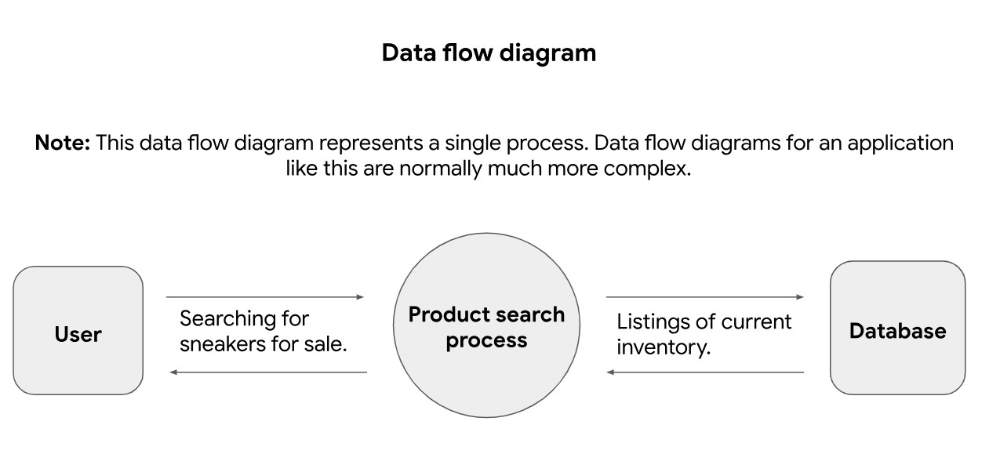
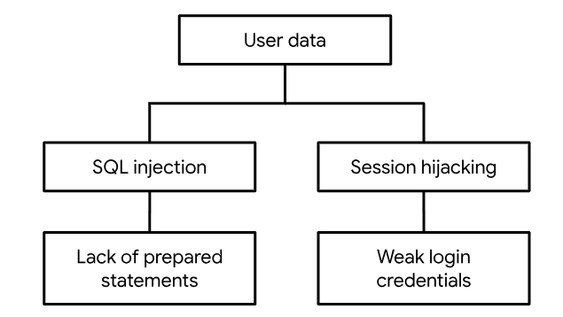

#### Process of Attack Simulation and Threat Analysis (PASTA) 

In this exercise from the Google Cybersecurity Professional Certificate program, I will be using the PASTA framework to determine if a website is safe to launch.

Information in *italics* will be questions or descriptions from the lab.

### Setting the Scene

*You’re part of the growing security team at a company for sneaker enthusiasts and collectors. The business is preparing to launch a mobile app that makes it easy for their customers to buy and sell shoes.*

*You are performing a threat model of the application using the PASTA framework. You will go through each of the seven stages of the framework to identify security requirements for the new sneaker company app.*

### PASTA Stages

Below I will address each of the stages in the pasta model in regards to this app.

#### Define Business and Security Objectives
From the Description below:

*Description: Our application should seamlessly connect sellers and shoppers. It should be easy for users to sign-up, log in, and manage their accounts. Data privacy is a big concern for us. We want users to feel confident that we’re being responsible with their information.*

*Buyers should be able to directly message sellers with questions. They should also have the ability to rate sellers to encourage good service. Sales should be clear and quick to process. Users should have several payment options for a smooth checkout process. Proper payment handling is really important because we want to avoid legal issues.*

I identified these Business Objectives.

**Business Objectives**

- Allow for posting shoe ads.
- Allow for searching shoe ads.
- Allow for sign in and accounts with messaging.
- Process payments for sales.
- Generate shipping labels and keep track fo tracking numbers.

**Security Objectives**

- Safely process credit card information.
- Store usernames and messages in a secure way.
- Store addresses and payment details in a secure way (PCI Data Security Standards for all localities, check for local laws on addresses)
- Accounts need to be secure to prevent highjacking payment options or impersonation.
- Passwords need to be verified securely.
- MFA should be implemented for accounts if requested so a whole system will need to be set up (email verification, authenticator apps, etc.).

#### Define the Technical Scope

*the app will be exchanging and storing a lot of user data. These are some of the technologies that it uses:*

- *Application programming interface (API): An API is a set of rules that define how software components interact with each other. In application development, third-party APIs are commonly used to add functionality without having to program it from scratch.*
- *Public key infrastructure (PKI): PKI is an encryption framework that secures the exchange of online information. The mobile app uses a combination of symmetric and asymmetric encryption algorithms: AES and RSA. AES encryption is used to encrypt sensitive data, such as credit card information. RSA encryption is used to exchange keys between the app and a user's device.*
- *SHA-256: SHA-256 is a commonly used hash function that takes an input of any length and produces a digest of 256 bits. The sneaker app will use SHA-256 to protect sensitive user data, like passwords and credit card numbers.*
- *Structured query language (SQL): SQL is a programming language used to create, interact with, and request information from a database. For example, the mobile app uses SQL to store information about the sneakers that are for sale, as well as the sellers who are selling them. It also  uses SQL to access that data during a purchase.*

*Which of these technologies would you evaluate first? How might they present risks from a security perspective?*

Because of how the database design will ripple through the rest of the project, SQL will probably be the first thing to be evaluated. From the start we need to ensure that any information that we need to encrypt or hash is stored that way when the rest of the system is designed. We also need to evaluate how the automated statements are executed. We want them to be prepared statements, from a computer that we control, that evaluates the content before adding it to the prepared statement to ensure that it is compatible with the database design.

#### Decompose Application

*One of the app's processes might be to allow buyers to search the database for shoes that are for sale.*

*Open the PASTA data flow diagram resource. Review the diagram and consider how the technologies you evaluated relate to protecting user data in this process.*

The user will be using the app with an API interface.

That API interface will use PKI to securely access the product search process.

The product search process will use SQL to access the database.

And the same technologies will be at play when returning the data in each case.

#### Threat Analysis

*List 2 types of threats that are risks to the information being handled by the sneaker company's app.*

- Account compromise: Account recovery tools could be used to give access to a 3rd party to a users account.
- Password leaks: A malicious actor or employee could access the table that stores login information and recover either passwords, password hashes and salts giving them the ability to bypass password check limits.

#### Vulnerability Analysis

*List 2 types of vulnerabilities that could be exploited.*

SQL injection might be exploited if our app is not configured correctly.

Replay attacks might be exploited if our login system does not use single use numbers as challenges during sign in.

#### Attack Modeling

*Review the diagram and consider how threat actors can potentially exploit these attack vectors.*

SQL injection: display information directly from tables into the app instead of approved views of information.

Session Highjacking: Collect session cookie from MitM attack and use it to access a user account.

#### Risk analysis and Impact

*List 4 security controls that you have learned about that can reduce the chances of a security incident, like a data breach.*

- salt and hash passwords so that if someone gets access to the passwords table they can't just access all of the accounts.
- use prepared statements on a company controlled computer to access SQL tables.
- use https to process requests to our api.
- use a password policy to ensure that passwords are hard to guess and cannot be guessed many times.