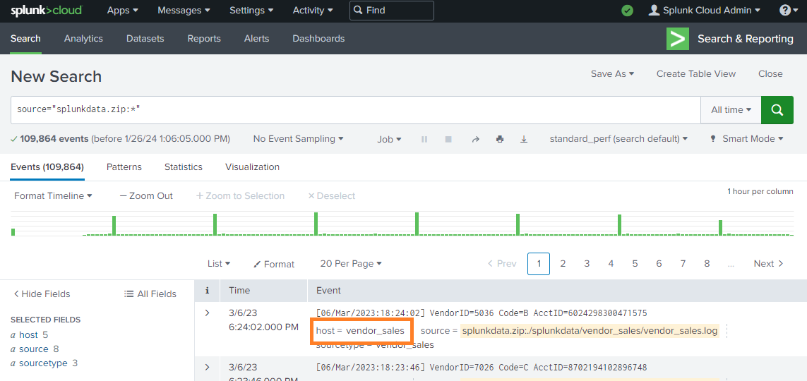

# Preform a Query with Splunk

In this exercise from the Google Cybersecurity Professional Certificate program, I will conduct use some mock data fom logs of "Buttercup Games" email servers and web accounts. IN this Exercise I will be using authentication logs, email logs, and others all found in the ./splunkdata folder.

Information in *italics* will be questions or descriptions from the lab.

### Setting up Splunk

In this lab I'm going to be working on splunk cloud.
To set this up I followed the instructions on the splunk website to create a free account. and logged into the Splunk Cloud dashboard.

The dashboard is primarily interacted with through a GUI. so I will include screenshots to document it.

This is our home page where we start.

#### Adding data

First we click on Settings as highlighted in the orange box below:

From here a dropdown box is shown. in the dropdown box we have the Add data button as highlighted in the orange box below:

Okay, that didn't seem to work, we are going off the book. There is an upload button on the homepage.

We are back on the book and see our upload page.

I compressed the ./splunkdata to a zip file and uploaded that. We see the name of the file in a red box and next I will press next highlighted in an orange box.

On the next page We have the ingestion settings, I was asked to change the option that is shown in red below.

In looking into host segment for splunk I came across this community post.

https://community.splunk.com/t5/Getting-Data-In/inputs-conf-segment-setting/m-p/346029

So looking at the folder we will see five hosts that are formatted like this:
- mailsv
- vender_sales
- www1
- www2
- www3

The index and Source type seem to be working in their basic automatic mode that detects what it is working with and makes it's best basic assumptions about the information that it is given.

So once the orange button was clicked on the settings page we are able to see a review page and everything looks good so we click the next button highlighted in orange.

We are given a success page afterwards.

We navigate back to home and next we want to run a query. we click on Search and Reporting highlighted in orange.

so now we are on the search page. we want to start our first query so lets get everything. Below we search "index=main" meaning grab all data in the repository of data called main. This is the location of all of our data. Then, we change the time window to all time and click the search. The described inputs are highlighted in orange.

Upon looking at the host names I realized I did some stuff wrong with the host segments I'm going to delete all the affected data and set host segments to 2.

Lets get our permissions done right first. under Settings>User we can find our account in Settings>Role we can see a role "can_delete" with 0 members, lets get in on that role.

I don't know if this is the best use of separation of duties or of minimizing privileges, but I allowed "sc_admin", a role that I was, to inherit the permissions of "can_delete". I pressed the orange stuff below in the sc_admin role editor.

lets wrap-up that delete.

I am going to redo the upload with a host segments set to 2.
And I got the host right this time. Yey!!!!

In case you forgot that this is a lab not a tutorial the below section is from the lab.

*Because you've been tasked with exploring any failed SSH logins for the root account on the mail server, you'll need to narrow the search results for events from the mail server.*

*Under SELECTED FIELDS, click host and click mailsv.*

the search bar now looks like this and has expected results.

    source="splunkdata.zip:*" host=mailsv

further we will limit this to events that contain any fail... words (including just "fail") as well as the exact word root. 

    source="splunkdata.zip:*" host=mailsv fail* root

we have 346 total results that look like the one below.

Generally, they all have various dates, origin IP, and origin port. they have the same, host, message format, and time of day. Wait, time of day? what is that about? at 1:39:51am all of these are logged, we need to see if these are added to the log by a cronjob that fills out the whole day or if there is a botnet trying to login.

next I searched based on time of day:

    source="splunkdata.zip:*" host=mailsv fail* root (date_hour="1") (date_minute="39")

I got 346 results

    source="splunkdata.zip:*" host=mailsv fail* root (date_hour="1") (date_minute="12")

got 0 results

and before specifying time. we had 346 results.

    source="splunkdata.zip:*" host=mailsv root success (date_hour="1") (date_minute="39")

got 0 results meaning that we are at least not immediately comprimised.

### Journal Entry

|Date: 1-26-24 | Entry: 00002|
|--|--|
|Description | botnet trying to brute force login for mail server|
|Tool(s) Used| Splunk cloud |
|Who | a botnet unclear source |
|What | a large number of login attempts happened over many days at a particular time of day |
|When| 3/3/23 - 3/6/23 at 1:39:51 every day |
|Where| mailsv server|
|Why| email has to be open to the internet, |
|Notes|  we may need to whitelist ip addresses for sshing into the mail server. or just drop incoming calls to port 22 to the mail server. |
